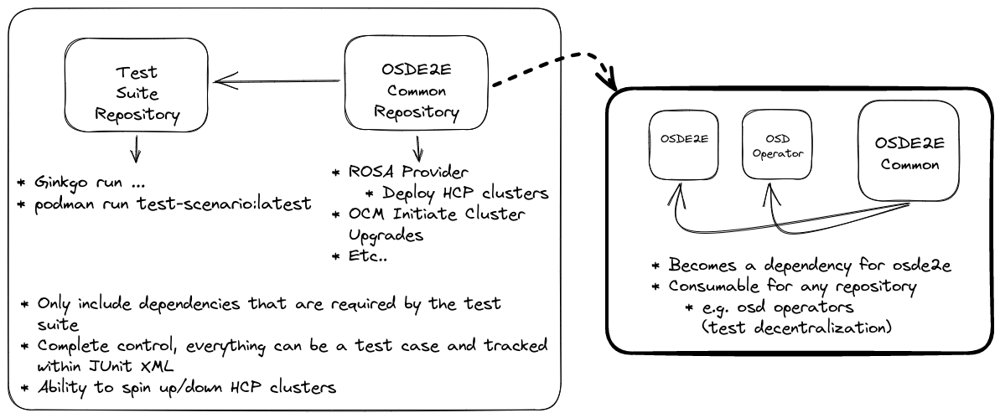

Since this was a proof of concept, refer to [openshift/osde2e](https://github.com/openshift/osde2e)
repository to view the latest up to date test suite.

# ROSA Hosted Control Plane MC & SC Upgrade Testing

This repository contains the automated test suite to cover verifying
cluster upgrades for Management (MC) & Service clusters (SC) can be upgraded
successfully for either Y/Z stream when hosted control plane workloads (HCP)
are running on them.

The test suite can be easily run by invoking `ginkgo run` directly,
from a `compiled binary` or from a `container image`. The container image
option makes this image consumable by other CI frameworks
for easy running.

## Test Suite Model

* Before Suite
  * Verify all the required test suite input data is defined
  * Perform necessary setup to access MC/SC
  * Identify MC/SC installed cluster versions and upgrade version
  * Deploy ROSA Hosted Control Plane cluster to simulate customer workload
* After Suite
  * Destroy ROSA Hosted Control Plane cluster that was used for simulation
* Test Cases:
  * Perform SC upgrade
  * Verify SC post upgrade health checks
  * Verify Hosted Control Plane cluster was unaffected by the upgrade
  * Perform MC upgrade
  * Verify MC post upgrade health checks
  * Verify Hosted Control Plane cluster was unaffected by the upgrade

The test suite is ordered and has labels allowing you to customize what is
performed. For example:

* `ginkgo run`
  * Will run through the entire test suite mentioned above
* `ginkgo run --label-filter="ApplyHCPWorkloads || RemoveHCPWorkloads || SCUpgrade"`
  * Will do everything except upgrade the management cluster
* `ginkgo run --label-filter="ApplyHCPWorkloads || RemoveHCPWorkloads || MCUpgrade"`
  * Will do everything except upgrade the service cluster
* `ginkgo run --label-filter="ApplyHCPWorkloads || SCUpgrade || MCUpgrade"`
  * Will do everything except remove the hcp clusters deployed



## How To Run

### Prerequisites

* Your RH OCM account must have all the necessary permissions for:
  * OSD fleet manager
  * Access OSD fleet manager clusters via oc client (kubeconfig)
  * Ability to deploy hosted control plane clusters
  * Ability to pin hosted control plane clusters

### Run Ginkgo Directly

```shell
OCM_TOKEN=<OCM_TOKEN> \
OSD_FLEET_MGMT_MANAGEMENT_CLUSTER_ID=<OSD_FLEET_MGMT_MANAGEMENT_CLUSTER_ID> \
OSD_FLEET_MGMT_SERVICE_CLUSTER_ID=<OSD_FLEET_MGMT_SERVICE_CLUSTER_ID> \
PROVISION_SHARD_ID=<PROVISION_SHARD_ID> \
UPGRADE_TYPE=<UPGRADE_TYPE> \
ginkgo run --timeout 4h
```

### Run Container Image

```shell
# Build image
make build-image

# Run container
export CONTAINER_ENGINE=<podman|docker>
$CONTAINER_ENGINE run -e OCM_TOKEN \
-e OSD_FLEET_MGMT_MANAGEMENT_CLUSTER_ID=<OSD_FLEET_MGMT_MANAGEMENT_CLUSTER_ID> \
-e OSD_FLEET_MGMT_SERVICE_CLUSTER_ID=<OSD_FLEET_MGMT_SERVICE_CLUSTER_ID> \
-e PROVISION_SHARD_ID=<PROVISION_SHARD_ID> \
-e UPGRADE_TYPE=<UPGRADE_TYPE> \
validate-mcsc-upgrades:latest
```
